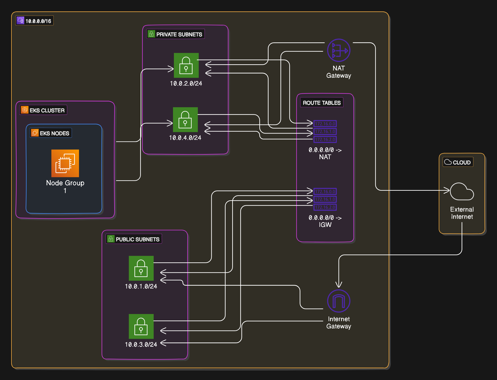

# K8sLab-TF (work-in-progress)
Kubernetes lab using terraform; easily create and destroy your lab resources for testing and development.



---
# To Use This Lab

* Install Terraform and Kubectl
* Fork a local copy
* Create the following files with the listed attributes:
  - **locals.tf** (example):
    ```
    locals {
      env    = "staging"
      region = "us-west-2"
      zone1  = "us-west-2a"
      zone2  = "us-west-2b"
      eks_name = "eks-${local.env}"
      eks_version = "1.30"
      ami_name = "<AMI_NAME>"
    }
    ```
  - **providers.tf** (example): 
    ```
    terraform {
      required_providers {
        aws = {
          source  = "hashicorp/aws"
          version = "~> 5.0"
        }
      }
    }

    provider "aws" {
      region                   = local.region
      shared_config_files      = ["~/.aws/config"]
      shared_credentials_files = ["~/.aws/credentials"]
      profile                  = "<PROFILE_NAME>"
    }
    ---
* Initialize the project with Terraform:
  ```
  terraform init
  ```
* Check your work 
  ```
  terraform plan
  ```
* Deploy your cluster
  ```
  terraform apply
  ```
* Confirm the cluster is running
  ```
  aws eks describe-cluster --name <cluster-name> --query "cluster.status"
  ```
* Confirm Admin access to cluster
  ```
  kubectl auth can-i "*" "*"
  ```
* Add a node:
  ```
  aws eks update-kubeconfig \
  --region us-west-2
  --name <cluster-name>
  ```
* Confirm node was created
  ```
  kubectl get nodes
  ```

# RBACLab
RBAC (Role-Based Access Control) is a method to regulate access to resources based on the roles assigned to users, groups, or service accounts In **Kubernetes**. Developer and Manager roles are also created in IAM that are bound to in the RBAC config files.
* Adding IAM Developer and Manger Roles
    - **add-developer-user.tf**
    - **add-manager-role.tf**
* **admin-cluster-role-binding.yaml**: This ClusterRoleBinding assigns the powerful cluster-admin ClusterRole to the group wjb-admin. This grants full administrative privileges over the entire cluster to the members of the wjb-admin group. This is a critical binding and should be limited to trusted users who require full control over the Kubernetes cluster.
* **viewer-cluster-role-binding.yaml**: This ClusterRoleBinding assigns the viewer ClusterRole to the group wjb-viewer. This ensures that all members of the wjb-viewer group have read-only access to the resources defined in the viewer ClusterRole across the cluster. It’s a solid setup for a group requiring visibility but no modification rights.
* **viewer-cluster-role.yaml**: This ClusterRole is well-designed for users or service accounts needing read-only access to these resources across the cluster. It does not allow modifications (e.g., creating or deleting resources), which maintains security while providing visibility into the cluster.

---

# HPALab
* Adding a Horizontal Pod Autoscaler

---

# Tools used on this project
* Hashicorp Terraform
* Kubernetes
* EKS
* Eraser
* Infracost
* Copilot
* ChatGPT

---

# AWS Cost Breakdown
## Usage Estimation
> Estimates by Infracost.

## Resources

| Name                           | Monthly Qty | Unit   | Monthly Cost |
|---------------------------------|-------------|--------|--------------|
| **aws_eks_cluster.eks**         | 730         | Hours  | $73.00       |
| **aws_eks_node_group.general**  | 730         | Hours  | $60.74       |
| - Instance usage (t3.large)     |             |        |              |
| - Storage (gp2, 20 GB)          | 20          | GB     | $2.00        |
| **aws_nat_gateway.nat**         | 730         | Hours  | $32.85       |
| - Data processed (depends on usage) |         |        | $0.045/GB    |

| Overall Total                   | Monthly Qty | Unit   | Monthly Cost |
|---------------------------------|-------------|--------|--------------|
| **aws_eks_cluster.eks**         | 730         | Hours  | $73.00       |

| Project | Baseline Cost | Usage Cost | Monthly Cost | Hourly Cost |
|---------|---------------|------------|--------------|-------------|
| main    | $169          | N/A        | $169         | $0.24       |

| Resource Summary            | **Total resources detected:** |
|-----------------------------|-------------------------------|
|  - 3 were estimated         |                          29   |
|  - 24 were free             |                               |
|  - 2 are not supported yet  |                               |

---

# Acknowedgements
## Anton Putra, AWS EKS Kubernetes Tutorial 
https://www.youtube.com/playlist?list=PLiMWaCMwGJXnKY6XmeifEpjIfkWRo9v2l