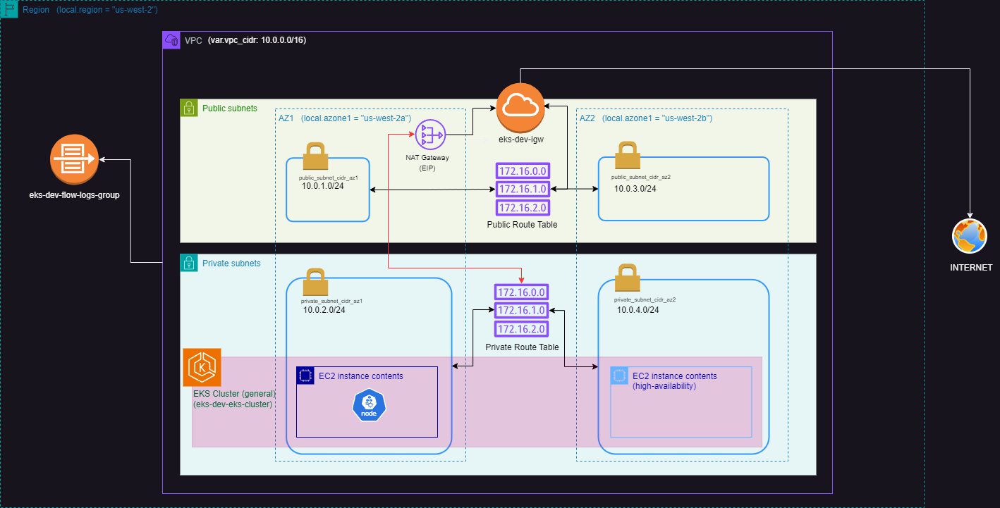

# K8sLab-TF 

Kubernetes lab deployed with Terraform using this easy to create and destroy K8s-EKS lab.




---

## Overview

This project allows you to quickly set up a Kubernetes cluster on AWS EKS using Terraform. It's designed to create resources in a modular, scalable way for testing and development purposes.

---

## Prerequisites

* Install **Terraform** and **Kubectl** on your var machine.
* Set up **AWS CLI** and configure your credentials:
  - Ensure you have `~/.aws/config` and `~/.aws/credentials` files set up properly.
  - You'll need an AWS account and an IAM user with sufficient permissions to create resources like EKS clusters, subnets, and VPCs.

---

## Setup Instructions

1. **Clone the repository**:
   ```bash
   git clone <repository-url>
   ```

2. **Create the following files**:
   
   - **locals.tf** (example):
     ```hcl
     locals {
        eks_name              = "eks-${var.env}"        
     }
     ```

   - **variables.tf** (example):
     ```hcl
      variable "instance_profile" {
         description = "The name of the instance profile"
         default     = "<PROFILE_NAME>"


      variable "account_id" {
         description = "The AWS account ID"
         default     = "<YOUR_ACCOUNT_ID>"
      }

      variable "env" {
         description = "The environment name (e.g., dev, prod)"
         default     = "dev"
      }

      variable "region" {
         description = "The AWS region to deploy resources"
         default     = "us-west-2"
      }

      variable "azone1" {
         description = "The first availability zone"
         default     = "us-west-2a"
      }

      variable "azone2" {
         description = "The second availability zone"
         default     = "us-west-2b"
      }

      variable "eks_name" {
         description = "The name of the EKS cluster"
         default     = "eks-changeme"
      }

      variable "eks_version" {
         description = "The version of EKS to deploy"
         default     = "1.31"
      }

      variable "node_instance_type" {
         description = "The instance type for the EKS worker nodes"
         default     = "t3a.medium"
      }

      variable "desired_cluster_size" {
         description = "The desired number of worker nodes in the EKS cluster"
         default     = 1
      }

      variable "min_cluster_size" {
         description = "The minimum number of worker nodes in the EKS cluster"
         default     = 0
      }

      variable "max_cluster_size" {
         description = "The maximum number of worker nodes in the EKS cluster"
         default     = 10
      }

      variable "max_unavailable" {
         description = "The maximum number of unavailable nodes during a node update"
         default     = 1
      }

      variable "capacity_type" {
         description = "The capacity type for the node group (ON_DEMAND or SPOT)"
         default     = "ON_DEMAND"
      }

      # Variables from original variables.tf

      variable "ami_name" {
         description = "The name of the AMI to use for the EKS nodes"
         default     = ""
      }

      variable "vpc_cidr" {
         description = "The CIDR block for the VPC"
         default     = "10.0.0.0/16"
      }

      # Subnet variables
      variable "public_subnet_cidr_az1" {
         description = "CIDR block for the public subnet in availability zone 1"
         default     = "10.0.1.0/24"
      }

      variable "private_subnet_cidr_az1" {
         description = "CIDR block for the private subnet in availability zone 1"
         default     = "10.0.2.0/24"
      }

      variable "public_subnet_cidr_az2" {
         description = "CIDR block for the public subnet in availability zone 2"
         default     = "10.0.3.0/24"
      }

      variable "private_subnet_cidr_az2" {
         description = "CIDR block for the private subnet in availability zone 2"
         default     = "10.0.4.0/24"
      }

      variable "key_name" {
         description = "The name of the SSH key to use for the EKS nodes"
         default     = ""
      }

     ```
   * **terraform.tfvars** These are values for the variables defined in the above **variables** file. These are replace the values in the variables file.
      ```bash
         instance_profile      = "<YOUR_PROFILE>"
         account_id            = "<YOUR_ACCOUND_ID>"
         env                   = "dev"
         region                = "us-west-2"
         azone1                = "us-west-2a"
         azone2                = "us-west-2b"
         eks_version           = "1.31"
         node_instance_type    = "t3a.medium"
         desired_cluster_size  = 1
         min_cluster_size      = 0
         max_cluster_size      = 10
         max_unavailable       = 1
         capacity_type         = "ON_DEMAND"

         ami_name                 = "al2023-ami-2023.5.20240903.0-kernel-6.1-x86_64"
         vpc_cidr                 = "10.123.0.0/16"
         public_subnet_cidr_az1   = "10.123.1.0/24"
         private_subnet_cidr_az1  = "10.123.2.0/24"
         public_subnet_cidr_az2   = "10.123.3.0/24"
         private_subnet_cidr_az2  = "10.123.4.0/24"

         key_name                 = "<YOUR_SECRET_KEY>"
      ``` 

3. **Initialize the project with Terraform**:
   ```bash
   terraform init
   ```

4. **Check your work**:
   ```bash
   terraform plan
   ```

5. **Deploy your cluster**:
   ```bash
   terraform apply
   ```

6. **Confirm the cluster is running**:
   ```bash
   aws eks describe-cluster --name <cluster-name> --query "cluster.status"
   ```

7. Verify **Kubectl** setup
   ```bash
   aws eks update-kubeconfig --name <cluster-name> --region us-west-2
   ```

8. **Confirm admin access to the cluster**:
   ```bash
   kubectl auth can-i "*" "*"
   ```

9. **Add a node group**:
   ```bash
   aws eks update-kubeconfig --region us-west-2 --name <cluster-name>
   ```

10. **Confirm node creation**:
   ```bash
   kubectl get nodes
   ```

11. **Add Developer Users and Management Roles (optional)**:
    * Uncomment and edit the commands in **add-developer-user.tf** and **add-manager-roles.tf**
    * Run the RBAC yaml files using **kubectl**
      ```bash
      kubectl apply -f ./RBAC/admin-cluster-role-binding.yaml
      kubectl apply -f ./RBAC/viewer-cluster-role-binding.yaml
      kubectl apply -f ./RBAC/viewer-cluster-role.yaml
      ```
    * Apply them:
      ```bash
      terraform apply
      ```

---

## Upcoming Enhancements

*  HPA (Horizontal Pod Autoscaler)
*  Cluster Autoscaler
*  AWS Load Balancer
*  Nginx Ingress Controller

## Tools Used in This Project

* **HashiCorp Terraform**
* **Kubernetes**
* **AWS EKS**
* **Eraser**
* **Infracost**
* **Copilot**
* **ChatGPT**

---

## AWS Cost Breakdown

This section provides an estimated cost breakdown for running this lab on AWS. Estimates are provided by **Infracost**.

### Usage Estimation

> Sep 2024 estimates generated by Infracost.

### Key Resources and Monthly Costs

| Resource                         | Monthly Qty | Unit   | Monthly Cost |
|-----------------------------------|-------------|--------|--------------|
| **aws_eks_cluster.eks**           | 730         | Hours  | $73.00       |
| **aws_eks_node_group.general**    | 730         | Hours  | $60.74       |
| - Instance usage (t3.large)       |             |        |              |
| - Storage (gp2, 20 GB)            | 20          | GB     | $2.00        |
| **aws_nat_gateway.nat**           | 730         | Hours  | $32.85       |
| - Data processed (depends on usage) |           |        | $0.045/GB    |

### Total Monthly Estimate
| Project | Baseline Cost | Usage Cost | Monthly Cost | Hourly Cost |
|---------|---------------|------------|--------------|-------------|
| main    | $169          | N/A        |       $169   |       $0.24 |
---------------------------------------------------------------------

# Acknowledgements
## Anton Putra https://www.youtube.com/@AntonPutra
> Amazing EKS Tutorials:
> https://www.youtube.com/watch?v=ppJZ4m4t0bI&list=PLiMWaCMwGJXnKY6XmeifEpjIfkWRo9v2l
