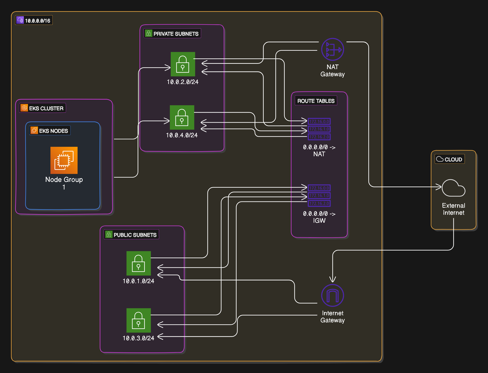

# K8sLab-TF (Work-in-progress)

Kubernetes lab using Terraform; easily create and destroy your lab resources for testing and development.



---

## Overview

This project allows you to quickly set up a Kubernetes cluster on AWS EKS using Terraform. It's designed to create resources in a modular, scalable way for testing and development purposes.

---

## Prerequisites

* Install **Terraform** and **Kubectl** on your local machine.
* Set up **AWS CLI** and configure your credentials:
  - Ensure you have `~/.aws/config` and `~/.aws/credentials` files set up properly.
  - You'll need an AWS account and an IAM user with sufficient permissions to create resources like EKS clusters, subnets, and VPCs.

---

## Setup Instructions

1. **Clone the repository**:
   ```bash
   git clone <repository-url>
   ```

2. **Create the following files**:
   
   - **locals.tf** (example):
     ```hcl
     locals {
       env         = "staging"
       region      = "us-west-2"
       zone1       = "us-west-2a"
       zone2       = "us-west-2b"
       eks_name    = "eks-${local.env}"
       eks_version = "1.30"
       ami_name    = "<AMI_NAME>"
     }
     ```

   - **providers.tf** (example):
     ```hcl
     terraform {
       required_providers {
         aws = {
           source  = "hashicorp/aws"
           version = "~> 5.0"
         }
       }
     }

     provider "aws" {
       region                   = local.region
       shared_config_files      = ["~/.aws/config"]
       shared_credentials_files = ["~/.aws/credentials"]
       profile                  = "<PROFILE_NAME>"
     }
     ```

3. **Initialize the project with Terraform**:
   ```bash
   terraform init
   ```

4. **Check your work**:
   ```bash
   terraform plan
   ```

5. **Deploy your cluster**:
   ```bash
   terraform apply
   ```

6. **Confirm the cluster is running**:
   ```bash
   aws eks describe-cluster --name <cluster-name> --query "cluster.status"
   ```

7. **Confirm admin access to the cluster**:
   ```bash
   kubectl auth can-i "*" "*"
   ```

8. **Add a node group**:
   ```bash
   aws eks update-kubeconfig --region us-west-2 --name <cluster-name>
   ```

9. **Confirm node creation**:
   ```bash
   kubectl get nodes
   ```

---

## RBACLab (Role-Based Access Control)

RBAC (Role-Based Access Control) is a method to regulate access to resources based on the roles assigned to users, groups, or service accounts in **Kubernetes**. This project includes Terraform code to set up IAM Developer and Manager roles, which are then bound to Kubernetes RBAC config files.

### RBAC Roles:
* **IAM Developer Role**: Bound to a Developer role in Kubernetes, granting limited access for development tasks.
* **IAM Manager Role**: Bound to a Manager role, providing more extensive access to manage the cluster.
  
For managing these roles:
- Terraform files for creating roles:
  - **add-developer-user.tf**
  - **add-manager-role.tf**
  
- RBAC role binding files:
  - **admin-cluster-role-binding.yaml**

---

## Horizontal Pod Autoscaler Lab (HPALab)

This section of the project adds a **Horizontal Pod Autoscaler** to automatically scale the number of pods in your cluster based on CPU usage or other metrics.

---

## Tools Used in This Project

* **HashiCorp Terraform**
* **Kubernetes**
* **AWS EKS**
* **Eraser**
* **Infracost**
* **Copilot**
* **ChatGPT**

---

## AWS Cost Breakdown

This section provides an estimated cost breakdown for running this lab on AWS. Estimates are provided by **Infracost**.

### Usage Estimation

> Estimates generated by Infracost.

### Key Resources and Monthly Costs

| Resource                         | Monthly Qty | Unit   | Monthly Cost |
|-----------------------------------|-------------|--------|--------------|
| **aws_eks_cluster.eks**           | 730         | Hours  | $73.00       |
| **aws_eks_node_group.general**    | 730         | Hours  | $60.74       |
| - Instance usage (t3.large)       |             |        |              |
| - Storage (gp2, 20 GB)            | 20          | GB     | $2.00        |
| **aws_nat_gateway.nat**           | 730         | Hours  | $32.85       |
| - Data processed (depends on usage) |           |        | $0.045/GB    |

### Total Monthly Estimate
| Project | Baseline Cost | Usage Cost | Monthly Cost | Hourly Cost |
|---------|---------------|------------|--------------|-------------|
| main    | $169          | N/A        |       $169   |       $0.24 |
---------------------------------------------------------------------

